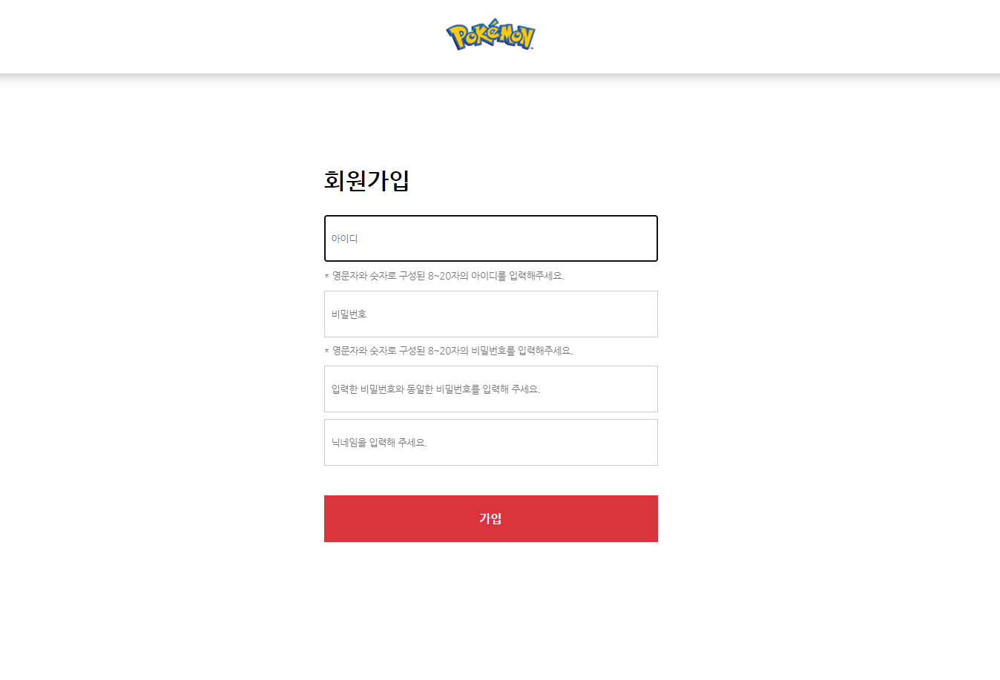
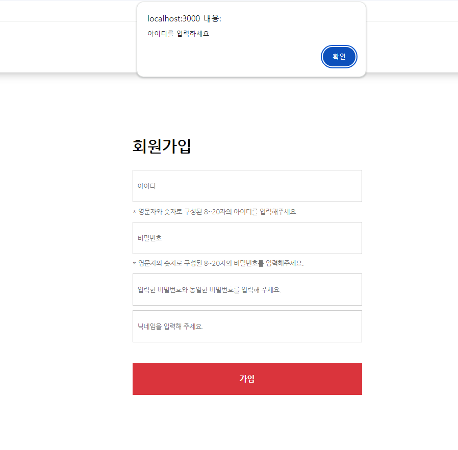
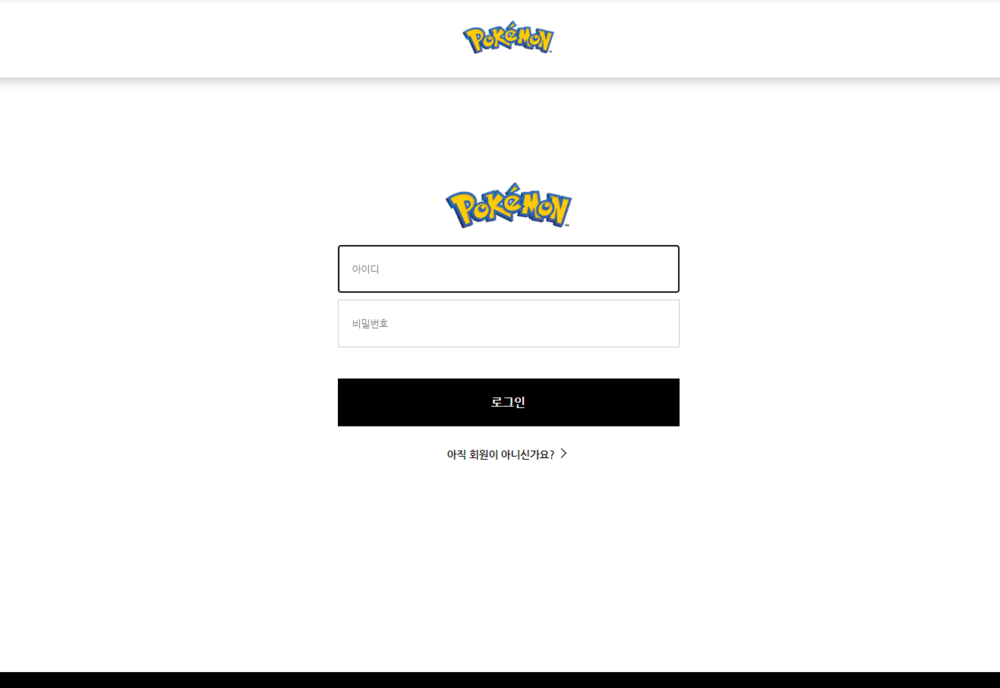
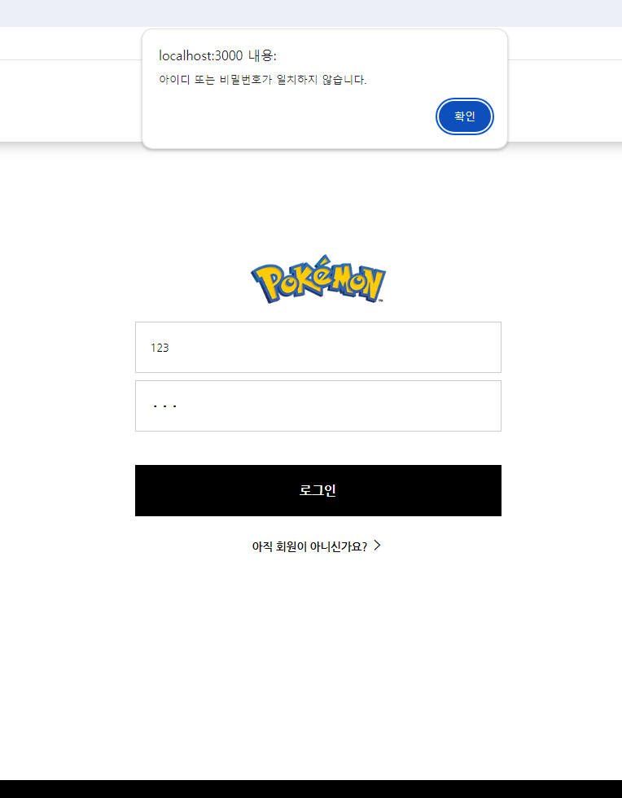
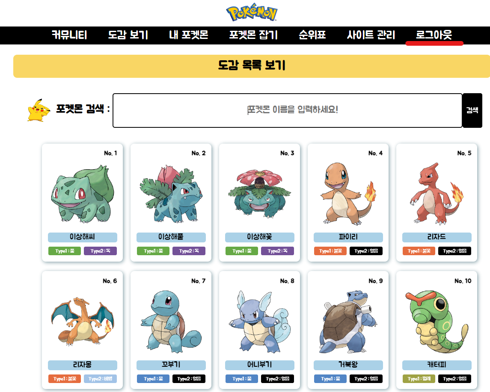

# Poketmon
삐까

< POKEMON GAME >

<1. 프로젝트 소개>
--------------------------------------------------------
--------------------------------------------------------
* 프로젝트 명 : POKEMON GAME
* 개발 기간 : 2024. 06. 25 ~ 2024. 07. 04
* 개발 인원 : 6명
* 핵심 기능 : 포켓몬스터 도감 확인 및 게임
 

<2. 개발 환경>
---------------------------------------------------------
---------------------------------------------------------
* IntelliJ (인텔리제이)
* Gradle (그래들)
* JAVA (자바)
* HTML, CSS, JAVA SCRIPT
* Sourcetree (소스 트리)
* GITHUB (깃허브)
* Docker Desktop
* dbeaver
 

<3. GitMind 작성>
---------------------------------------------------------
---------------------------------------------------------
-> 이미지 파일 추가 예정

 

<4. 기능 명세서>
----------------------------------------------------------
----------------------------------------------------------
 

< 관리자 >
----------------------------------------------------------
----------------------------------------------------------

 

##  < 회원 >
### 회원가입 
#### 비회원

- 로그인 화면에서 "아직 회원이 아니신가요?" 버튼을 누른다.
- 회원가입페이지로 이동 후 회원가입을 시행한다.
- 회원가입 항목 : 아이디, 비밀번호, 비밀번호 확인, 닉네임
- 회원가입 항목들을 입력한 후 회원가입 버튼을 누른다.
- DB에 사용자의 정보를 저장한다.
  - 단, 관리자계정인 경우 개발자가 DB에서 USERTYPE을 ADMIN으로 수정 및 변경하여 저장한다. 
- 회원가입 성공 시 로그인 화면으로 자동 이동한다.

#### 예외흐름

- 중복된 아이디로 회원가입 버튼을 누른경우
  -  "이미 가입된 아이디입니다." 라는 경고메세지를 띄운다.
- 비밀번호 확인란에 앞서 작성한 비밀번호롸 다른 비밀번호를 입력했을 경우
  - "비밀번호가 일치하지 않습니다." 라는 경고메세지를 띄운다.
- 아이디를 영어, 숫자 8~20자 조합이 아니게 입력했을 경우
  - "아이디 형식이 아닙니다." 라는 경고 메세지를 띄운다.
- 비밀번호를 영어, 숫자 8~20자 조합이 아니게 입력했을 경우
  - "비밀번호는 영문자와 숫자로 구성된 8자 이상 20자 이하로 입력해 주세요." 라는 경고 메세지를 띄운다.
- 사용자가 회원가입 항목을 입력하지 않은 경우 
  - 아이디 미입력 : "아이디를 입력하세요" 라는 경고 메세지를 띄운다.
  - 비밀번호 미입력 : "비밀번호를 입력하세요." 라는 경고 메세지를 띄운다.
  - 비밀번호 확인 미입력 : "비밀번호를 확인하세요." 라는 경고 메세지를 띄운다.
  - 닉네임 미입력 : "닉네임을 입력하세요." 라는 경고 메세지를 띄운다.
- 비회원이 회원가입 및 로그인을 시행하지 않고 url수정을 통해 회원전용게시판에 접근하는 경우
  -  로그인페이지로 강제이동시킨다.

### 로그인
#### 회원, 관리자

- 회원 및 관리자 전용사이트이므로 사이트 접속 시 로그인페이지를 띄워준다.
- 로그인 항목 : 아이디, 비밀번호
- 로그인 항목을 입력한 후 로그인 버튼을 누른다.
- DB에서 아이디를 기준으로 회원목록을 조회하여 아이디와 비밀번호가 일치하는지 확인한다.
- 사용자가 입력한 아이미 및 비밀번호가 DB에 저장된 데이터와 일치하는 경우 메인 화면으로 자동이동한다.
  - 단, 관리자가 로그인을 한 경우 관리자 전용 메인화면으로 자동 이동한다. 
  - 회원, 관리자 구분 기준 : DB에 저장된 USERTYPE이 ADMIN이면 관리자이고 USER이면 회원으로 인식한다.

#### 예외흐름

- 가입하지 않은 아이디로 로그인 버튼을 누른 경우
  - "아이디 또는 비밀번호가 일치하지 않습니다." 라는 경고 메세지를 띄운다.
- 가입한 비밀번호와 다른 비밀번호로 로그인 버튼을 누른 경우
   - "아이디 또는 비밀번호가 일치하지 않습니다." 라는 경고 메세지를 띄운다.
- 사용자가 아이디 항목을 입력하지 않은 경우
  - 아이디 미입력 : "아이디를 입력하세요." 라는 경고 메세지를 띄운다.
  - 비밀번호 미입력 : "비밀번호를 입력하세요." 라는 경고 메세지를 띄운다.

### 로그아웃

- 사용자가 로그아웃 버튼을 누른다.
- 사용자의 세션을 비워준다.
- 로그인 페이지로 자동 이동한다.

 

----------------------------------------------------------

 

< 게시글 >
----------------------------------------------------------
----------------------------------------------------------

 

< 도감 >
----------------------------------------------------------
----------------------------------------------------------

 

< 게임 > 
----------------------------------------------------------
----------------------------------------------------------

 

< 내 포켓몬 >
----------------------------------------------------------
----------------------------------------------------------

 

<5. DB 연동 테이블>
----------------------------------------------------------
----------------------------------------------------------
(1) 게시판 테이블

CREATE TABLE BOARD (  
BID VARCHAR2(30) PRIMARY KEY,  
BNAME VARCHAR2(60) NOT NULL,  
ROWS_PER_PAGE NUMBER(4) DEFAULT 20,  
ACTIVE NUMBER(1) DEFAULT 0,  
ACTIVE_CATEGORY NUMBER(1) DEFAULT 0,  
CATEGORY CLOB,  
AUTHORITY VARCHAR2(10) DEFAULT 'ALL' CHECK(AUTHORITY IN ('ALL', 'USER', 'ADMIN'))  
);
 

(2) 게시판 설정 테이블

CREATE TABLE BOARD_DATA (  
SEQ NUMBER(10) PRIMARY KEY,  
BID VARCHAR2(30),  
GID VARCHAR2(45),  
POSTER VARCHAR2(40) NOT NULL,  
MEMBER_SEQ NUMBER(10) DEFAULT 0,  
GUEST_PASSWORD VARCHAR2(65),  
CATEGORY VARCHAR2(40),  
NOTICE NUMBER(1) DEFAULT 0,  
SUBJECT VARCHAR2(255) NOT NULL,  
CONTENT CLOB NOT NULL,  
UA VARCHAR2(150),  
IP VARCHAR2(30),  
REG_DT DATE DEFAULT SYSDATE,  
MOD_DT DATE  
);
 

(3) 멤버 테이블
CREATE TABLE MEMBER(  
USER_NO NUMBER(10) PRIMARY KEY,  
USER_ID VARCHAR2(60) UNIQUE NOT NULL,  
PASSWORD VARCHAR2(65) NOT NULL,  
USER_TYPE VARCHAR2(20) DEFAULT 'USER' CHECK(USER_TYPE IN ('USER', 'ADMIN')),  
NICKNAME VARCHAR2(50) UNIQUE NOT NULL,  
MY_POKEMON_SEQ NUMBER(10) DEFAULT 0  
);
 

(4) 내 포켓몬 테이블
CREATE TABLE MYPOKEMON (  
USER_NO NUMBER(10) REFERENCES MEMBER(USER_NO),  
POKEMON_NO NUMBER(10) REFERENCES POKEMON(SEQ),  
NICKNAME VARCHAR2(50)  
);
 

(5) 포켓몬 API 연동 테이블
CREATE TABLE POKEMON (  
SEQ NUMBER(10) PRIMARY KEY,  
NAME VARCHAR2(60) NOT NULL,  
WEIGHT NUMBER(7) DEFAULT 0,  
TYPE1 VARCHAR2(60) NOT NULL,  
TYPE2 VARCHAR2(60),  
FLAVOR_TEXT VARCHAR2(1000),  
FRONT_DEFAULT VARCHAR2(1000),  
RAW_DATA CLOB  
);
 

<6. 역할 분담>
----------------------------------------------------------
----------------------------------------------------------
* 회원가입 및 로그인 : 박세현
* 관리자 및 게시글 : 김정훈
* 포켓몬 도감 및 개별 포켓몬 : 정채윤
* 포켓몬 사냥 게임 : 김정현
* 포켓몬 게임 랭킹 조회 : 김선규
* 내 포켓몬 : 채연화

 

<7. 일정표>
----------------------------------------------------------
----------------------------------------------------------

-> 한셀 이미지로 추가할 예정