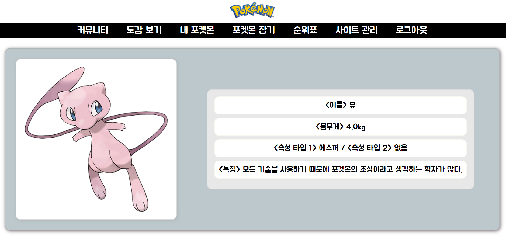

# Poketmon
삐까


< POKEMON GAME >

## 1. 프로젝트 소개
--------------------------------------------------------

* 프로젝트 명 : POKEMON GAME
* 개발 기간 : 2024. 06. 25 ~ 2024. 07. 04
* 개발 인원 : 6명
* 핵심 기능 : 포켓몬스터 도감 확인 및 게임
<br>

## 2. 개발 환경
---------------------------------------------------------


[기술스택] : Java Oracle OpenJDK 17.0.10, SQL, HTML5, CSS3, JavaScript

[사용툴] : Gradle 8.4ver, Dbeaver 24.0.3ver, Git

[프레임워크] : MyBatis 

[라이브러리] : JSTL

[API] : 포켓몬 API

[서버] : Apache Tomcat ver.10

[컨테이너] : Docker Desktop

[프로그램] : IntelliJ IDEA 2024.1.3
<br>

## 3. GitMind 작성
---------------------------------------------------------


<br>

## 4. 역할 분담
----------------------------------------------------------

* 회원가입 및 로그인 : 박세현
* 관리자 및 게시글 : 김정훈
* 포켓몬 도감 및 개별 포켓몬 : 정채윤
* 포켓몬 사냥 게임 : 김정현
* 포켓몬 게임 랭킹 조회 : 김선규
* 내 포켓몬 : 채연화
<br>

## 5. 일정표
----------------------------------------------------------


-> 한셀 이미지로 추가할 예정

## 6. DB 연동 테이블
----------------------------------------------------------


- DB TABLE 전체 표


- DB 개별 테이블

(1) 게시판 테이블
```sql
CREATE TABLE BOARD ( 
BID VARCHAR2(30) PRIMARY KEY,
BNAME VARCHAR2(60) NOT NULL,
ROWS_PER_PAGE NUMBER(4) DEFAULT 20,
ACTIVE NUMBER(1) DEFAULT 0,
ACTIVE_CATEGORY NUMBER(1) DEFAULT 0, 
CATEGORY CLOB, 
AUTHORITY VARCHAR2(10) DEFAULT 'ALL' CHECK(AUTHORITY IN ('ALL', 'USER', 'ADMIN')) 
);
```

-------------------------------------------------------------------------------- 
<br>

(2) 게시판 설정 테이블
```sql
CREATE TABLE BOARD_DATA (
SEQ NUMBER(10) PRIMARY KEY, 
BID VARCHAR2(30),
GID VARCHAR2(45), 
POSTER VARCHAR2(40) NOT NULL, 
MEMBER_SEQ NUMBER(10) DEFAULT 0, 
GUEST_PASSWORD VARCHAR2(65), 
CATEGORY VARCHAR2(40),
NOTICE NUMBER(1) DEFAULT 0,
SUBJECT VARCHAR2(255) NOT NULL,
CONTENT CLOB NOT NULL,
UA VARCHAR2(150),
IP VARCHAR2(30),
REG_DT DATE DEFAULT SYSDATE,
MOD_DT DATE 
);
```

--------------------------------------------------------------------------------
<br>

(3) 멤버 테이블
```sql
CREATE TABLE MEMBER(
USER_NO NUMBER(10) PRIMARY KEY, 
USER_ID VARCHAR2(60) UNIQUE NOT NULL, 
PASSWORD VARCHAR2(65) NOT NULL, 
USER_TYPE VARCHAR2(20) DEFAULT 'USER' CHECK(USER_TYPE IN ('USER', 'ADMIN')),
NICKNAME VARCHAR2(50) UNIQUE NOT NULL, 
MY_POKEMON_SEQ NUMBER(10) DEFAULT 0 
);
```
--------------------------------------------------------------------------------
<br>

(4) 내 포켓몬 테이블
```sql
CREATE TABLE MYPOKEMON (
USER_NO NUMBER(10) REFERENCES MEMBER(USER_NO),
POKEMON_NO NUMBER(10) REFERENCES POKEMON(SEQ), 
NICKNAME VARCHAR2(50) 
);
```
--------------------------------------------------------------------------------
<br>

(5) 포켓몬 API 연동 테이블
```sql
CREATE TABLE POKEMON (
SEQ NUMBER(10) PRIMARY KEY, 
NAME VARCHAR2(60) NOT NULL, 
WEIGHT NUMBER(7) DEFAULT 0, 
TYPE1 VARCHAR2(60) NOT NULL,
TYPE2 VARCHAR2(60),
FLAVOR_TEXT VARCHAR2(1000),
FRONT_DEFAULT VARCHAR2(1000),
RAW_DATA CLOB
);
```
--------------------------------------------------------------

## 6. 기능 명세서
----------------------------------------------------------

<br>

< 관리자 >
----------------------------------------------------------


<br>

## 회원 
----------------------------------------------------------

✅ 회원가입 
-
### 비회원
- 로그인 화면에서 "아직 회원이 아니신가요?" 버튼을 누른다.
- 회원가입페이지로 이동 후 회원가입을 시행한다.
- 회원가입 항목 : 아이디, 비밀번호, 비밀번호 확인, 닉네임
- 회원가입 항목들을 입력한 후 회원가입 버튼을 누른다.
- DB에 사용자의 정보를 저장한다.
  - 비밀번호는 DB에 저장 시 암호화(hashing)되어 저장된다. 
  - 모든 사용자는 우선 USERTYPE 이 USER 와 ADMIN 중 USER로 DB에 저장된다.  
  - 관리자계정의 경우 개발자가 DB에서 USERTYPE을 ADMIN으로 수정 및 변경하여 저장한다.
  - 혹은 관리자 게시판에서 관리자(ADMIN)가 사용자(USER)를 관리자(ADMIN)로 수정 및 변경한다.
- 회원가입 성공 시 로그인 화면으로 자동 이동한다.


<br>

### 예외흐름
- 중복된 아이디로 회원가입 버튼을 누른 경우
  -  "이미 가입된 아이디입니다." 라는 경고메세지를 띄운다.
- 비밀번호 확인란에 앞서 작성한 비밀번호롸 다른 비밀번호를 입력했을 경우
  - "비밀번호가 일치하지 않습니다." 라는 경고메세지를 띄운다.
- 아이디를 영어, 숫자 8~20자 조합이 아니게 입력했을 경우
  - "아이디 형식이 아닙니다." 라는 경고 메세지를 띄운다.
- 비밀번호를 영어, 숫자 8~20자 조합이 아니게 입력했을 경우
  - "비밀번호는 영문자와 숫자로 구성된 8자 이상 20자 이하로 입력해 주세요." 라는 경고 메세지를 띄운다.
- 중복된 닉네임으로 회원가입 버튼을 누른 경우
  - "이미 사용중인 닉네임입니다."라는 경고메세지를 띄운다. 
- 사용자가 회원가입 항목을 입력하지 않은 경우 
  - 아이디 미입력 : "아이디를 입력하세요" 라는 경고 메세지를 띄운다.
  - 비밀번호 미입력 : "비밀번호를 입력하세요." 라는 경고 메세지를 띄운다.
  - 비밀번호 확인 미입력 : "비밀번호를 확인하세요." 라는 경고 메세지를 띄운다.
  - 닉네임 미입력 : "닉네임을 입력하세요." 라는 경고 메세지를 띄운다.
- 비회원이 회원가입 및 로그인을 시행하지 않고 url수정을 통해 회원전용게시판에 접근하는 경우
  -  로그인페이지로 강제이동시킨다.


✅ 로그인
-
## 회원, 관리자
- 회원 및 관리자 전용사이트이므로 사이트 접속 시 로그인페이지를 띄워준다.
- 로그인 항목 : 아이디, 비밀번호
- 로그인 항목을 입력한 후 로그인 버튼을 누른다.
- DB에서 아이디를 기준으로 회원목록을 조회하여 아이디와 비밀번호가 일치하는지 확인한다.
- 사용자가 입력한 아이디 및 비밀번호가 DB에 저장된 데이터와 일치하는 경우 메인 화면으로 자동이동한다.
  - 단, 관리자가 로그인을 한 경우 관리자 전용 메인화면으로 자동 이동한다. 
  - 회원, 관리자 구분 기준 : DB에 저장된 USERTYPE이 ADMIN이면 관리자이고 USER이면 회원으로 인식한다.


<br>

## 예외흐름
- 가입하지 않은 아이디로 로그인 버튼을 누른 경우
  - "아이디 또는 비밀번호가 일치하지 않습니다." 라는 경고 메세지를 띄운다.
- 가입한 비밀번호와 다른 비밀번호로 로그인 버튼을 누른 경우
   - "아이디 또는 비밀번호가 일치하지 않습니다." 라는 경고 메세지를 띄운다.
- 사용자가 아이디 항목을 입력하지 않은 경우
  - 아이디 미입력 : "아이디를 입력하세요." 라는 경고 메세지를 띄운다.
  - 비밀번호 미입력 : "비밀번호를 입력하세요." 라는 경고 메세지를 띄운다.


✅ 로그아웃
-
- 사용자가 로그아웃 버튼을 누른다.
- 사용자의 세션을 비워준다.
- 로그인 페이지로 자동 이동한다.


<br>

## 게시글
----------------------------------------------------------


<br>

## 도감
---------------------------------------------------------------

✅ 포켓몬 도감
-
- 포켓몬 공식 사이트 API 연동
- API에서 도감에 들어갈 세부사항 중 필요한 부분 (이름, 번호, 속성 등) 만 뽑아서 DB에 POKEMON 테이블 생성하여 저장 
- 연동한 API 도감 카드화
- 카드화한 포켓몬으로 목록화하여 도감 페이지 완성


✅ 개별 포켓몬
-
- 포켓몬 도감 페이지에서 포켓몬 클릭 시 개별 포켓몬 페이지로 이동
- 개별 페이지 이동 시 포켓몬 사진 + 포켓몬 이름, 몸무게, 속성 타입 1 & 2, 특징 정보 확인


<br>

## 게임
----------------------------------------------------------

✅ 이름 맞추기 게임
- 
- POKEMON 테이블에서 랜덤 포켓몬 실루엣, 설명, 속성을 뽑아서 가져온 뒤 이름 맞추기 퀴즈 형식으로 문제 출제 <br>

 

- 오른쪽 화살표 버튼을 클릭 시 새로운 포켓몬으로 새로고침
- 오답 시 정답 입력 하단에 텍스트가 표시됨 <br>

<br>
- 한 번 잡은 포켓몬은 재등장하지 않음

✅ 마이 포켓몬 저장
-
- 잡은 포켓몬의 별명, 번호, 유저 번호를 MYPOKEMON 테이블에 저장<br>


- 좌측 '박스로 이동' 버튼을 누를 시 '내 포켓몬' 탭으로 이동하며 별명을 저장 (별명을 지정하지 않을 시 기본 포켓몬 이름)
- 다시 하기 버튼을 누를 시 저장을 포기하며, 다시 '포켓몬 잡기' 탭으로 이동 <br>


## 랭킹
----------------------------------------------------------

✅ 전체 랭킹
- MYPOKEMON 테이블에 저장된 값 중 회원번호(USER_NO)와 포켓몬 번호(POKEMON_NO)로 순위를 나열하여 전체 유저 중 TOP10 랭킹 출력


- 유저별 포켓몬 포획 횟수(점수)가 동일할 시 같은 순위를 매기고 다음 순위를 미룸 -> 사진 참고 (6위가 두 명이면 다음 순위가 8위)


- 순위 중복이 많아 랭킹 10위까지의 유저가 10명이 넘는 경우면 전부 출력하지 않고 상위 10개까지만 출력되게 함

✅ 유저 랭킹 검색


- 유저의 아이디를 검색하여 순위와 점수를 확인, 한 번 검색 후 연이어 다른 아이디의 랭킹을 확인할 수 있도록 상단에 아이디 검색창 유지

<br>


- 가입되어 있지 않은 아이디를 검색했을 시 해당하는 사용자가 없다는 내용의 화면 출력함
- 모든 검색이 끝나고 순위표로 이동 버튼 클릭 시 다시 TOP10 랭킹을 보여 주는 화면으로 이동
<br>


< 내포켓몬 >   
----------------------------------------------------------

✅ 내포켓몬 보기 
- 이름맞추기게임에서 결과를 로그인된 MEMBER 테이블과 MYPOKEMON 에 저장된 값으로 조회해서 화면에 출력 및 수정 

<br>
✅ 랜덤 포켓몬 프로필 설정하기 


- 비밀번호 확인후 수정하기를 누르면 저장되어있는 API 로 이미지와 정보를 받아와서 랜덤으로 포켓몬을 뽑아서 프로필 사진 설정,변경 


